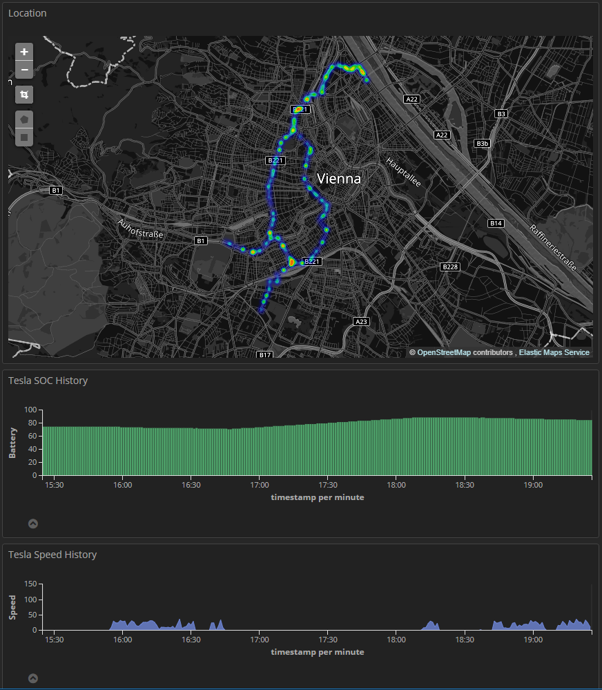
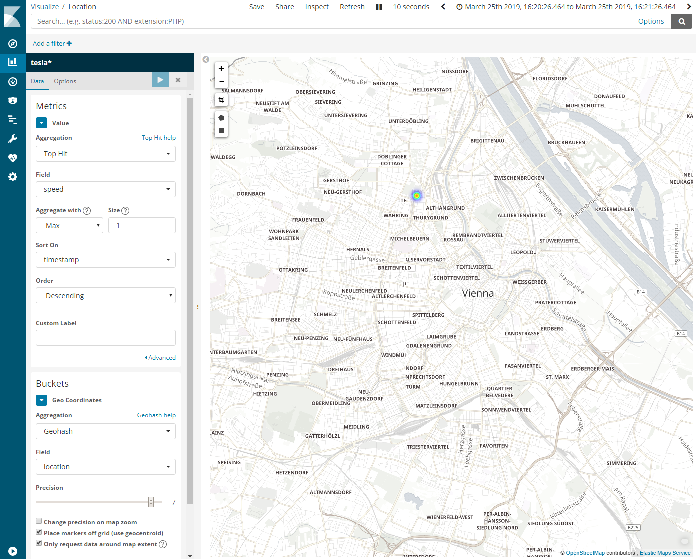

# tesla_dashboard_backend

A simple python backend to pull data periodically from the Tesla API into your own ELK stack. Avoids battery drain by having the correct timing to allow the car to go to sleep properly.
Note: The start of a drive may be missed by a few minutes. Feel free to play with the sleep intervals.





Installation
------------

First edit tesla_fetch.py with your credentials (tesla email and password). Change Elasticsearch endpoint URI as needed (right now it's assumed that ES runs locally)

```bash
apt install elasticsearch python3 python3-pip screen
pip3 install tesla_api
./create_index.sh
screen -dmS teslafetcher python3 tesla_fetch.py
```

If you want to visualize the data, use kibana, grafana, or something similar. Grafana has better map support.
To get a map that shows a heatmap of the recent locations, make sure you use the "top hit" aggregation because that lets you sort by timestamp and show only the most recent ones, matching your current time interval settings. So if you want just a dot with the current position, set the time selection to the last minute and that should do the trick. Or set it to a larger timespan and enjoy the lovely heatmap.



